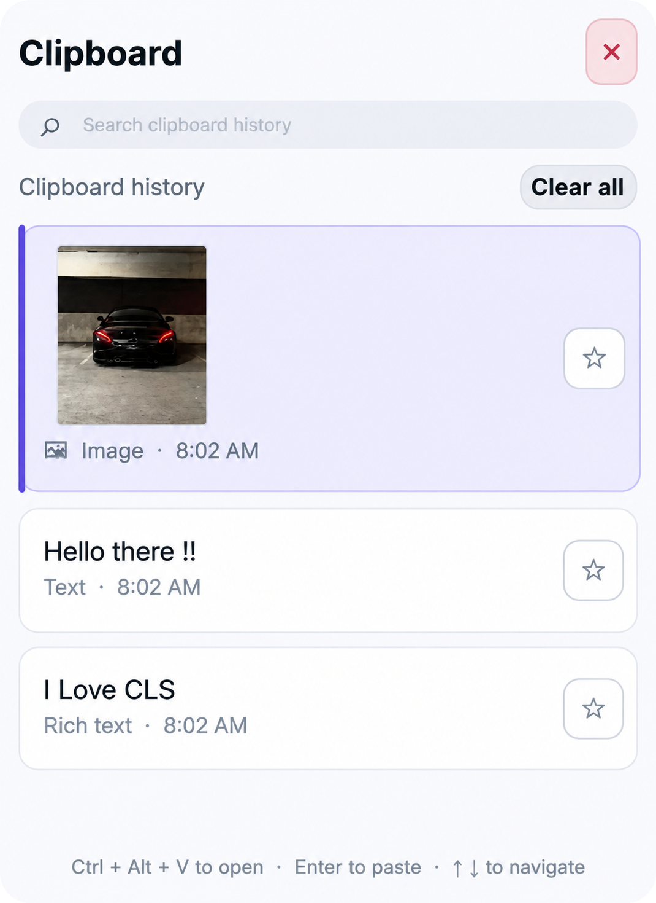

<div align="center">

# 📋 Clipboard History

**A lightweight, native clipboard history manager for Linux - the familiar Windows clipboard experience, reimagined for your desktop.**

Runs quietly in the system tray and opens a fast, searchable overlay with a single hotkey: **`Ctrl+Alt+V`**.

[](LICENSE)
[-informational)](#requirements)
[](#build--package-contributors)

[Features](#features) • [Install](#installation) • [Usage](#usage) • [Build from Source](#build--package-contributors)


  


</div>


---

## Features

| | |
|---|---|
| ⚡ **Instant access** | Open a Windows-style clipboard popup anywhere on screen with `Ctrl+Alt+V`, positioned near your cursor. |
| 🪟 **True popup window** | Override-redirect, always-on-top, and hidden from the taskbar and Alt+Tab list. |
| ⌨️ **Keyboard-first navigation** | Arrow keys to select, type to filter, `Enter` to paste - no mouse required. |
| 🖱️ **Click to paste** | Click any row and it's pasted instantly. |
| 🔁 **Real paste injection** | Places the item on the clipboard, restores focus to your previous app, and injects a genuine `Ctrl+V`. |
| 🔍 **Search as you type** | Instantly filter your history; `Backspace` refines the query. |
| 🖼️ **Image support** | Copied images - images are saved and shown as thumbnails. |
| 📝 **Text & rich text** | Both are captured and rendered with a clean preview. |
| 📌 **Pin items** | Star important entries so **Clear all** never touches them. |
| 🧹 **Clear all** | One click clears unpinned history, with a confirmation dialog. |
| 🧬 **Duplicate detection** | Re-copying an existing item bumps it to the top instead of duplicating it. |
| 💾 **Persistent history** | Everything is stored in a local SQLite database and survives restarts. |
| 🧰 **System tray integration** | Runs quietly in the background; the tray menu opens the popup or quits the app. |
| 🎯 **Focus management** | The popup takes keyboard focus while open and hands it back when dismissed. |

---

## Requirements

- A **64-bit (amd64)** Debian-based distribution:
  - Debian **12+**
  - Ubuntu **22.04+**
  - Linux Mint **21+**
- An **X11** session - required for the global hotkey, popup focus handling, and paste injection.

> **⚠️ Wayland note:** the native hotkey and popup focus handling require X11. On Wayland, the app can still run from the tray, but the full overlay experience is limited. `Ctrl+Alt+V` works on X11, including XWayland sessions.

---

## Installation

### Download the latest release

Grab `clipboard-history_1.0.0_amd64.deb` from the **[v1.0.0 Release page](https://github.com/ogtamimi/clipboard-history/releases/tag/v1.0.0)**.

### Option A - Double-click install

1. **Download** the `.deb` file from the release page above.
2. **Double-click** it to open your package manager (Software Manager / GDebi).
3. Click **Install** and enter your password.
4. Launch **Clipboard History** from your Applications menu.
5. Press **`Ctrl+Alt+V`** to open the history popup.

### Option B - Terminal install

```bash
sudo apt install ./clipboard-history_1.0.0_amd64.deb
```

Then launch it (or find it in the Applications menu):

```bash
clipboard-history
```

The app starts in the background with a tray icon and **launches automatically at every login** (an autostart entry is installed for you). Open the popup anytime with **`Ctrl+Alt+V`**, or use the tray menu.

> The `.deb` package targets **amd64** only. For other architectures, build from source - see below.

### Updating

Install the newer `.deb` the same way you installed the first one:

```bash
sudo apt install ./clipboard-history_<new-version>_amd64.deb
```

The update replaces the old version cleanly and keeps your existing clipboard history intact.

### Uninstalling

```bash
sudo apt remove clipboard-history
```

This removes the program, menu entries, icons, and the autostart entry. Your personal history database under `~/.local/share` is preserved.

---

## Usage

Open the popup with **`Ctrl+Alt+V`** (or from the tray icon), then:

| Action | How |
|---|---|
| Open / hide popup | `Ctrl+Alt+V`, or click the tray icon |
| Select an item | `↑` / `↓`, or click a row |
| Paste selected item | `Enter`, or **click** any row |
| Search / filter | Type while the popup is open; `Backspace` to edit |
| Pin / unpin an item | Click the **★** button on the row (★ = pinned, ☆ = not pinned) |
| Clear unpinned history | **Clear all** button (top right), then confirm |
| Hide the popup | `Escape`, the **×** button, an outside click, or `Ctrl+Alt+V` again |

**What happens when you paste:**

1. The item is placed on the system clipboard and moved to the top of the history.
2. The popup closes.
3. Focus returns to the application you were using.
4. A real **`Ctrl+V`** keystroke is injected so the content actually appears.

---

## Data Location

Your clipboard history lives in a local SQLite database - nothing is sent anywhere:

```text
~/.local/share/Clipboard History/Clipboard/clipboard-history.db
```

Copied images are stored alongside it:

```text
~/.local/share/Clipboard History/Clipboard/images/
```

---

## Build & Package (Contributors)

> End users don't need this section - it's for people building the project from source.

### 1. Install build dependencies

```bash
chmod +x install-dependencies.sh
./install-dependencies.sh
```

This installs `cmake`, a C++ compiler, Qt 6 development packages, X11/XTest headers, the required QML modules, and the SQLite driver.

### 2. Build a `.deb` package (recommended)

```bash
./build-deb.sh
```

The resulting package is written to:

```text
dist/clipboard-history_<version>_amd64.deb
```

The `<version>` is derived from the single source of truth in `CMakeLists.txt`:
`project(ClipboardHistory VERSION x.y.z)`.

### 3. Or build and run in place

```bash
cmake -S . -B build -DCMAKE_BUILD_TYPE=Release
cmake --build build -j"$(nproc)"
./build/clipboard-history
```

> While the popup is open, it takes keyboard focus (just like Windows clipboard history) - so you can't type into the app behind it until it's dismissed.

### Continuous delivery

A [GitHub Actions workflow](.github/workflows/release.yml) automatically builds `clipboard-history_<version>_amd64.deb` whenever a `v*` tag is pushed, and attaches it to a GitHub Release:

```bash
git tag v1.0.0
git push origin v1.0.0
```

### Package contents & metadata

| Item | Location |
|---|---|
| Executable | `/usr/bin/clipboard-history` |
| Application menu entry | `/usr/share/applications/clipboard-history.desktop` |
| Autostart entry | `/etc/xdg/autostart/clipboard-history.desktop` |
| Icon | `/usr/share/icons/hicolor/scalable/apps/clipboard-history.svg` |
| License | `/usr/share/doc/clipboard-history/copyright` |

The package declares all its dependencies (`libqt6*`, `libx11-6`, `libxtst6`, QML modules, the SQLite driver), so `apt` resolves every library automatically on Debian 12 / Ubuntu 22.04+ / Linux Mint 21+.

---

## Tests

An integration harness drives a **running instance** over X11 and verifies the popup end to end - properties, keyboard focus, paste delivery, focus restoration, `Escape` dismissal, hotkey toggling, and outside-click dismissal.

```bash
cmake --build build -j"$(nproc)"
CLIPBOARD_DEBUG=1 ./build/clipboard-history &
python3 tests/integration_harness.py
```

The suite exits `0` when every check passes. It requires `python3-tk`, `python3-xlib`, and the `xwininfo` utility on the same X11 display.

---


## Project Structure

```text
clipboard-history/
├── .github/workflows/release.yml # Auto-builds a .deb for every v* tag
├── CMakeLists.txt                # Build config, install rules, CPack metadata
├── LICENSE                       # MIT license
├── build-deb.sh                  # Build dist/clipboard-history_<ver>_amd64.deb
├── install-autostart.sh          # Optional per-user autostart helper
├── install-dependencies.sh       # apt helper for source builds
├── qml/Main.qml                  # Popup UI (header, search, list, dialogs)
├── resources/
│   ├── clipboard-history.desktop # Menu + autostart entry
│   └── clipboard-history.svg     # App icon
├── src/
│   ├── main.cpp                  # Entry point, popup control, focus & XTest paste
│   ├── clipboardmodel.cpp/.h     # SQLite-backed list model + clipboard capture
│   └── globalhotkey.cpp/.h       # X11 global hotkey (Ctrl+Alt+V)
└── tests/
    └── integration_harness.py    # X11 end-to-end test suite
```

---

## License

Released under the **[MIT License](LICENSE)** © 2026 Ogtamimi.

The implementation contains no proprietary assets or branding - "Windows clipboard history" refers only to the user-interface concept.

---

<div align="center">

Made with ❤️ for the Linux desktop.

</div>